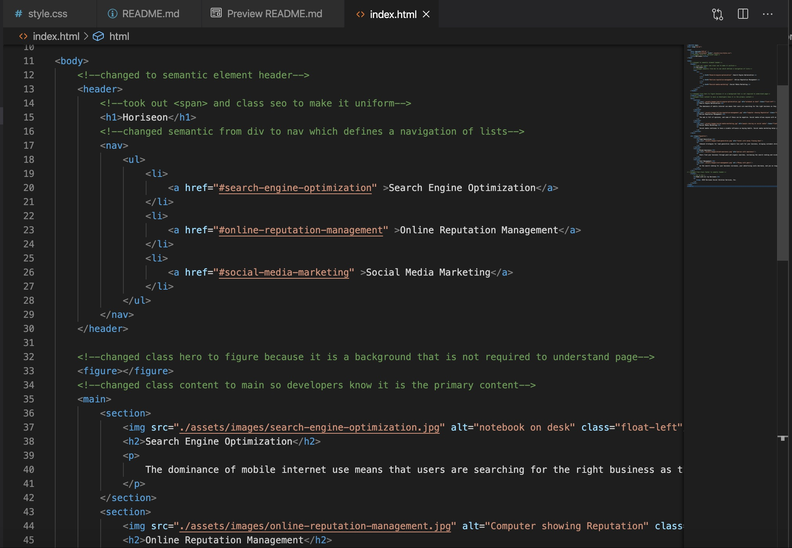

# Code_Refactor

## Description 

This first assignment was to take existing code and refractor it to meet a certain criteria. This entailed examining the code to change the code to include pre existing semantic html elements. This aslo entailed me looking up and further familiarizing myself with these elements. Furthermore, then changed the logical structuring of the code. I mainly did this by changing the CSS code because the code there was out of place and confusing. I also added alt attributes to all of the images in the html code as well as change the title so it reflected and described the page.

This was my first step in the world of coding and I ran into some obstacles and had to navigate my way around these to make the code work. Furthermore, I think I got too carried away in trying to make the code more condensed that I realized I might have changed the code so that it was less descriptive. Despite this I am confident that in time I can insert html and css.

I am looking forward to the feedback I receive from this project so that I can learn how to improve as a web developer. 

## Table of Contents

* [Installation](#installation)
* [Usage](#usage)
* [Credits](#credits)

## Installation

The installation for this project is to go my github repositories then navigate to Code_Refractor or click this link [Code_Refractor](https://github.com/hondahelix/Code_Refactor) then click on the green code button in the top right. Then you can copy the code via ssh or by downloading a zip file.

## Usage 

The usage for this project is to have a baseline for where I start in my coding career and see how much I improve from this point forward. As shown below I have much to learn and improve on.

The following is a screenshot of the website that I worked on.

## Credits
Third party assets and instruction was provided by the University of California, Berkeley Full Stack Coding Bootcamp program. 
[UCB Coding cootcamp](https://bootcamp.berkeley.edu/coding/)

---

## Badges

---

